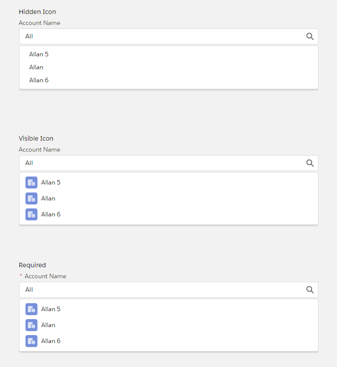
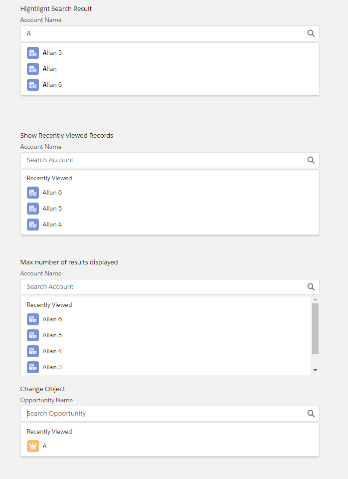

# LWC Lookup

Run the following commands

````bash
npm i
sfdx force:config:set defaultdevhubusername=DEV_HUB_ALIAS
sfdx force:org:create -a SCRATCH_ORG_ALIAS -f config/project-scratch-def.json
sfdx force:lightning:lwc:start
````

Then open `http://localhost:3333` and open the `c-lookup-test` to see the variations for this component.


